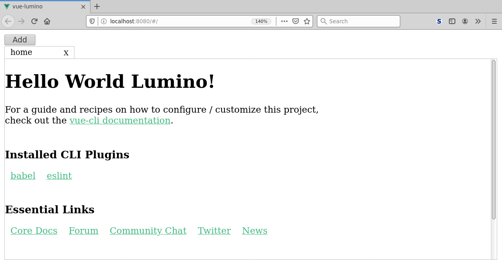

# vue-lumino


[](https://codecov.io/gh/tupilabs/vue-lumino)
[](https://www.npmjs.com/package/@tupilabs/vue-lumino)

An example project showing one way to integrate Vue.js and
[Lumino](https://github.com/jupyterlab/lumino) (née PhosphorJS).



Lumino *“is a library for building interactive web applications”*. It is used by JupyterLab to create the
top menu bar, widgets with close/maximize buttons, and other components that allow users to create
web applications.

Based on work done for [Cylc UI](https://github.com/cylc/cylc-ui).

## Installation

```bash
# npm
npm install @tupilabs/vue-lumino

# yarn
yarn add @tupilabs/vue-lumino
```

## Usage

You will have to import the `Lumino` component, and its stylesheet (or have a look at
it and choose how to better customize it).

`vue-lumino` will install JupyterLab Lumino for you, if that's not in your dependency
tree already. But you will still need to import the Lumino stylesheet as well in your
component or sass or similar code.

The diff below is probably the easiest way to show how to use the component. It was
created using `vue create` to create a new project using its default values. Then a version
of the library was installed locally, and with the diff applied the component is
ready to be used.

```diff
diff --git a/src/App.vue b/src/App.vue
index 3943904..f04b13d 100644
--- a/src/App.vue
+++ b/src/App.vue
@@ -1,13 +1,38 @@
 <template>
   <div id="app">
-    <div id="nav">
-      <router-link to="/">Home</router-link> |
-      <router-link to="/about">About</router-link>
-    </div>
-    <router-view/>
+    <!-- You can listen to lumino:delete and lumino:activate events, as below.
+           v-on:lumino:activated="someMethod(`activated widget ID ${$event.id}`)"
+           v-on:lumino:deleted="someMethod(`deleted widget ID ${$event.id}`)"
+    -->
+    <Lumino>
+      <!-- Re-using the vue-init provided component, which requires a msg :string prop. -->
+      <!-- You must provide an ID attribute, which the Lumino component uses internally. -->
+      <HelloWorld
+        id="home-test"
+        msg="Oi!"
+      />
+    </Lumino>
   </div>
 </template>
 
+<script>
+// Import component.
+import Lumino from '@tupilabs/vue-lumino'
+// Re-use the component created by the vue create command.
+import HelloWorld from './components/HelloWorld'
+
+// Import styles, or customize as necessary.
+import '@lumino/default-theme/style/index.css'
+import '@tupilabs/vue-lumino/dist/vue-lumino.css'
+
+export default {
+  components: {
+    Lumino,
+    HelloWorld
+  }
+}
+</script>
+
 <style lang="scss">
 #app {
   font-family: Avenir, Helvetica, Arial, sans-serif;
```


### Custom tab title

By default, the component uses the Vue Component name as the tab title. So if the
component is defined as below.

```js
export default {
  name: 'VueComponentName'
}
```

It means that the tab title of the component will use the title "VueComponentName".

Alternatively, it is possible to define a `prop` in the `Lumino` component to be used
for the tab title. The default value of that prop is "name".

```vue
<Lumino ref="lumino"
  v-on:lumino:deleted="onWidgetDeletedEvent"
  v-on:lumino:activated="onWidgetActivatedEvent"
  tab-title-prop="displayName"
>
</Lumino>
```

The `prop` **MAY** be present in each component rendered by the `Lumino` component. If the
component does not define the `prop`, then the `Lumino` component will use the default
value, i.e. the component name.

```vue
<Lumino ref="lumino"
  v-on:lumino:deleted="onWidgetDeletedEvent"
  v-on:lumino:activated="onWidgetActivatedEvent"
  tab-title-prop="displayName"
>
  <!-- HelloWorld tab titles will display TAB-HW-${id} -->
  <HelloWorld
    v-for="id of this.helloWorldWidgets"
    :key="id"
    :id="id"
    :display-name="`TAB-HW-${id}`"
  ></HelloWorld>
  <!-- ColoredCircle tab titles will display ${ColoredCircle.name}, IOW, `ColoredCircle` -->
  <ColoredCircle
    v-for="id of this.coloredCircleWidgets"
    :key="id"
    :id="id"
    :color="'red'"
  ></ColoredCircle>
</Lumino>
```

This is specially useful if you want to display a component is wrapped by another
component. A common example of this use case, is using a loader component such as
Vuetify Skeleton Loader.

## Building

```bash
$ yarn install             # install dependencies
$ yarn run serve           # run development server
$ yarn run build           # compiles and minifies for production
$ yarn run lint            # lint and fix files
$ yarn run test:unit       # run unit tests
$ yarn run test:e2e        # run e2e tests
```

## Notes on Typescript support

* https://github.com/ffxsam/vue-typescript-cookbook/blob/master/README.md

## License

Licensed under the Apache License. See LICENSE file for more.
